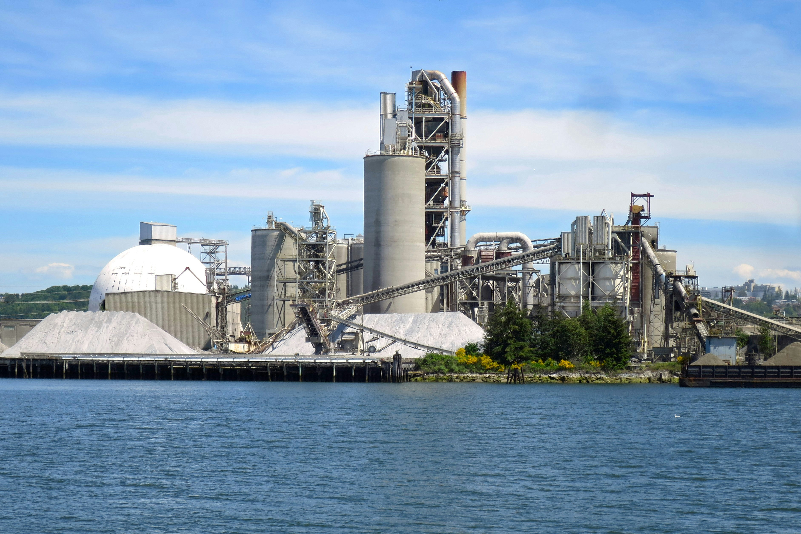

  <a href="index" style="margin: 0 15px; text-decoration: none; color: #003366; font-weight: bold;">🏠 Home</a> | 
  <a href="about" style="margin: 0 15px; text-decoration: none; color: #003366; font-weight: bold;">👤 About</a> | 
  <a href="cv" style="margin: 0 15px; text-decoration: none; color: #003366; font-weight: bold;">📄 CV</a> | 
  <a href="certifications" style="margin: 0 15px; text-decoration: none; color: #003366; font-weight: bold;">📜 Certs</a> | 
  <a href="contact" style="margin: 0 15px; text-decoration: none; color: #003366; font-weight: bold;">✉️ Contact</a>

# Syed Wakeel Ahmed
### Chemical Process Engineer | Operational Risk Governance

[LinkedIn](YOUR_LINKEDIN_URL) | [GitHub](https://github.com/wakeelahmedsyed) | [Email](mailto:YOUR_EMAIL)

---

## 🏗️ Engineering Project Portfolio

<table style="width: 100%; border-collapse: collapse; border: none;">
  <tr>
    <td style="width: 33%; padding: 10px; border: none; vertical-align: top;">
      
      <h3 style="margin-top: 10px; color: #003366; font-size: 1.1em;">🛡️ Risk Governance</h3>
      
Standardized JHA logic across 24 units using Python automation.

    </td>
    <td style="width: 33%; padding: 10px; border: none; vertical-align: top;">
      
      <h3 style="margin-top: 10px; color: #003366; font-size: 1.1em;">⚙️ Unit Commissioning</h3>
      
Led 250M PKR upgrade, QA testing, and PLC logic validation.

    </td>
    <td style="width: 33%; padding: 10px; border: none; vertical-align: top;">
      
      <h3 style="margin-top: 10px; color: #003366; font-size: 1.1em;">🚀 Capacity Expansion</h3>
      
Redesigned coal mill for +20% throughput (25 TPH).

    </td>
  </tr>

  <tr>
    <td style="width: 33%; padding: 10px; border: none; vertical-align: top;">
      
      <h3 style="margin-top: 10px; color: #003366; font-size: 1.1em;">🔥 Pyro-Process Audit</h3>
      
Heat & Mass balance for Kiln Line-2 with 99.7% accuracy.

    </td>
    <td style="width: 33%; padding: 10px; border: none; vertical-align: top;">
      
      <h3 style="margin-top: 10px; color: #003366; font-size: 1.1em;">☀️ Solar Predictive Mod.</h3>
      
21MW Solar load optimization using Hypothesis Testing.

    </td>
    <td style="width: 33%; padding: 10px; border: none; vertical-align: top;">
      
      <h3 style="margin-top: 10px; color: #003366; font-size: 1.1em;">💻 LNG System Design</h3>
      
Aspen Plus/HYSYS simulation with 97.2% model accuracy.

    </td>
  </tr>

 <tr>
    <td style="width: 33%; padding: 10px; border: none; vertical-align: top;">
      
      <h3 style="margin-top: 10px; color: #003366; font-size: 1.1em;">🏗️ 4,000 TPD Plant Design</h3>
      
Complete process sizing for greenfield pyro-processing unit.

    </td>
    <td style="width: 33%; padding: 10px; border: none; vertical-align: top;">
      
      <h3 style="margin-top: 10px; color: #003366; font-size: 1.1em;">📉 Reliability & Failure Analysis</h3>
      
Applied Poisson Distribution to analyze ClkBinLL failure modes in Cement Mill units.

    </td>
    <td style="width: 33%; padding: 10px; border: none; vertical-align: top;">
       

        
Future Project Placeholder

      

    </td>
  </tr>
</table>

---

## 🧰 Technical Skills Matrix

<table style="width: 100%; border-collapse: collapse; border: none; font-size: 0.9em;">
  <tr style="background-color: #f0f2f6;">
    <th style="padding: 10px; border: 1px solid #ddd;">Process & Design</th>
    <th style="padding: 10px; border: 1px solid #ddd;">Data & Reliability</th>
    <th style="padding: 10px; border: 1px solid #ddd;">Safety & Governance</th>
    <th style="padding: 10px; border: 1px solid #ddd;">Tools & Software</th>
  </tr>
  <tr>
    <td style="padding: 10px; border: 1px solid #ddd; vertical-align: top;">
      • Mass & Energy Balances 
      • Equipment Sizing (Kilns, Fans) 
      • P&ID / PFD Development 
      • Greenfield Plant Design 
      • Unit Commissioning (CapEx)
    </td>
    <td style="padding: 10px; border: 1px solid #ddd; vertical-align: top;">
      • Predictive Load Modeling 
      • Reliability Engineering (Poisson) 
      • Hypothesis Testing (Z/T-tests) 
      • Variance Analysis 
      • Specific Energy Consumption (SEC)
    </td>
    <td style="padding: 10px; border: 1px solid #ddd; vertical-align: top;">
      • JHA Framework Design 
      • HAZOP & SIL Leadership 
      • ISO 9001, 14001, 45001 
      • Root Cause Analysis (RCA) 
      • Operational Risk Mitigation
    </td>
    <td style="padding: 10px; border: 1px solid #ddd; vertical-align: top;">
      • <b>Simulation:</b> Aspen HYSYS/Plus 
      • <b>Computing:</b> Python (Pandas/NumPy) 
      • <b>CAD:</b> AutoCAD 
      • <b>Dashboards:</b> Streamlit 
      • <b>Industrial:</b> PLC Logic/SCADA
    </td>
  </tr>
</table>

  
  
  
  
  

---

## 📈 Professional Trajectory
I am a results-oriented Process Engineer with a focus on **Operational Excellence**. By combining traditional chemical engineering principles with modern data automation, I help industrial plants reduce risk and increase throughput. 

**Core Industries:** Cement Manufacturing, Industrial Chemicals, Process Safety.

---

  

