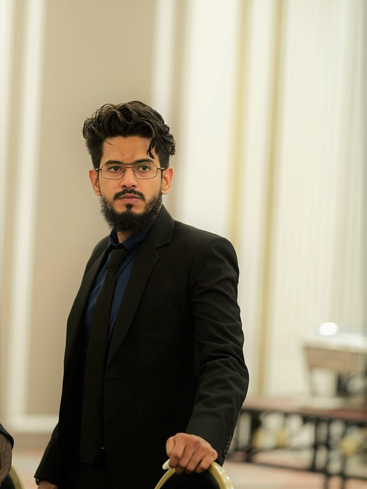

<table style="width: 100%; border-collapse: collapse; border: none; font-family: -apple-system, BlinkMacSystemFont, 'Segoe UI', Helvetica, Arial, sans-serif;">
  <tr>
    <td width="22%" valign="top" style="border-right: 1px solid #eeeeee; padding-right: 15px;">
      

        
        
        <h4 style="margin: 0; font-size: 1.1em; color: #24292e;">Syed Wakeel Ahmed</h4>
        
Process & Sustainability Engineer 5+ Years Industrial Experience

        
        

        
        <nav style="font-size: 0.62em; line-height: 2.2;">
          <a href="index" style="color: #0366d6; text-decoration: none;"> <b>Dashboard</b></a> 
          <a href="about" style="color: #444; text-decoration: none;"> About Me</a> 
          <a href="cv" style="color: #444; text-decoration: none;"> Curriculum Vitae</a> 
          <a href="certifications" style="color: #444; text-decoration: none;"> Certifications</a> 
          <a href="contact" style="color: #444; text-decoration: none;"> Contact</a>
        </nav>
        
        

        
        

          <a href="https://www.linkedin.com/in/syedwakeelahmed/" style="color: #0366d6; text-decoration: none;">LinkedIn</a> • 
          <a href="https://github.com/wakeelahmedsyed" style="color: #0366d6; text-decoration: none;">GitHub</a>
        

      

    </td>

    <td width="78%" valign="top" style="padding-left: 25px;">
      <h2 style="margin-top: 0; font-weight: 600; color: #24292e;">Industrial Process Portfolio</h2>
      
Process engineering, <b>decarbonization</b>, and <b>data-driven industrial optimization</b> — from plant floor to Python.

      
      

      <!-- ═══════════════════════════════════════════════════
           ⭐ FEATURED PROJECTS
      ═══════════════════════════════════════════════════ -->
      <h4 style="color: #003366; margin-bottom: 8px;">⭐ Featured Projects</h4>
      

        High-impact industrial optimization, sustainability, and data-driven engineering.
      

      <table width="100%" border="0" cellspacing="8" cellpadding="0" style="margin-bottom: 24px;">
        <tr>
          <td width="50%" valign="top" style="background: #fcfcfc; border: 1px solid #efefef; border-radius: 8px; padding: 10px;">
            
            

              <b>⛽ Alternate Fuel Integration</b> 
              Rs. 880K+ Daily Savings · 30% Coal Reduction · CO₂ ↓13%
            

          </td>
          <td width="50%" valign="top" style="background: #fcfcfc; border: 1px solid #efefef; border-radius: 8px; padding: 10px;">
            
            

              <b>🏗️ $50M Greenfield Design Audit</b> 
              EPC Verification · 3.6% Permanent SEC Reduction
            

          </td>
        </tr>
        <tr>
          <td width="50%" valign="top" style="background: #fcfcfc; border: 1px solid #efefef; border-radius: 8px; padding: 10px;">
            
            

              <b>🏆 Waste Gasification</b> 
              DeCarbon Days 2026 — 3rd Place · Circular Economy
            

          </td>
          <td width="50%" valign="top" style="background: #fcfcfc; border: 1px solid #efefef; border-radius: 8px; padding: 10px;">
            
            

              <b>☀️ Solar Predictive Modeling</b> 
              Python Statistical Engine · 6.25M PKR Savings
            

          </td>
        </tr>
      </table>

      <!-- ═══════════════════════════════════════════════════
           🏭 PROCESS ENGINEERING & OPERATIONS
      ═══════════════════════════════════════════════════ -->
      <h4 style="color: #003366; margin-bottom: 8px;">🏭 Process Engineering & Operations</h4>
      

        Plant-floor engineering: thermodynamics, commissioning, throughput optimization, and process simulation.
      

      <table width="100%" border="0" cellspacing="8" cellpadding="0" style="margin-bottom: 24px;">
        <tr>
          <td width="50%" valign="top" style="background: #fcfcfc; border: 1px solid #efefef; border-radius: 8px; padding: 10px;">
            
            

              <b>🚀 Coal Grinding Optimization</b> 
              +20% Throughput · Self-Initiated · 7M PKR/Year
            

          </td>
          <td width="50%" valign="top" style="background: #fcfcfc; border: 1px solid #efefef; border-radius: 8px; padding: 10px;">
            
            

              <b>🔥 Pyro Heat Balance & Fan Audit</b> 
              RCA · 0.25% Closure · CapEx Approved
            

          </td>
        </tr>
        <tr>
          <td width="50%" valign="top" style="background: #fcfcfc; border: 1px solid #efefef; border-radius: 8px; padding: 10px;">
            
            

              <b>⚙️ 250M PKR Commissioning</b> 
              PLC Fault Prevention · 50+ I/O Verified
            

          </td>
          <td width="50%" valign="top" style="background: #fcfcfc; border: 1px solid #efefef; border-radius: 8px; padding: 10px;">
            
            

              <b>💻 LNG Pretreatment Simulation</b> 
              Aspen HYSYS · 97.2% Model Accuracy
            

          </td>
        </tr>
      </table>

      <!-- ═══════════════════════════════════════════════════
           📈 ANALYTICS, RELIABILITY & SYSTEMS
      ═══════════════════════════════════════════════════ -->
      <h4 style="color: #003366; margin-bottom: 8px;">📈 Analytics, Reliability & Systems</h4>
      

        Data systems, Python automation, reliability modeling, risk governance, and technology assessment.
      

      <table width="100%" border="0" cellspacing="8" cellpadding="0">
        <tr>
          <td width="50%" valign="top" style="background: #fcfcfc; border: 1px solid #efefef; border-radius: 8px; padding: 10px;">
            
            

              <b>🛡️ Risk Governance</b> 
              Python-Automated ISO 45001 JHA · 24+ Units
            

          </td>
          <td width="50%" valign="top" style="background: #fcfcfc; border: 1px solid #efefef; border-radius: 8px; padding: 10px;">
            
            

              <b>📉 Reliability Engineering</b> 
              RAMS · Exponential/Poisson · 79.36% Availability
            

          </td>
        </tr>
        <tr>
          <td width="50%" valign="top" style="background: #fcfcfc; border: 1px solid #efefef; border-radius: 8px; padding: 10px;">
            
            

              <b>🚁 Drone Technology Review</b> 
              1,900+ Sources · 8-Point Economic Framework
            

          </td>
          <td width="50%" valign="middle" style="text-align: center; border: 1px dashed #ddd; border-radius: 8px; padding: 10px;">
            

              More projects in development
            

          </td>
        </tr>
      </table>

      

      <!-- ═══════════════════════════════════════════════════
           🧰 TECHNICAL SKILLS
      ═══════════════════════════════════════════════════ -->
      <h4 style="color: #003366; margin-bottom: 10px;">🧰 Technical Skills</h4>
      

        <b>Process:</b> Mass & Energy Balances, Equipment Sizing, Commissioning, HAZOP, P&ID 
        <b>Analytics:</b> Python (Pandas, SciPy, Statsmodels), SQL, Power BI, TSA, Hypothesis Testing 
        <b>Simulation:</b> Aspen HYSYS, Aspen Plus, PLC/SPS Logic 
        <b>Standards:</b> ISO 9001, ISO 45001, ISO 14001, NFPA, API
      

    </td>
  </tr>
</table>
